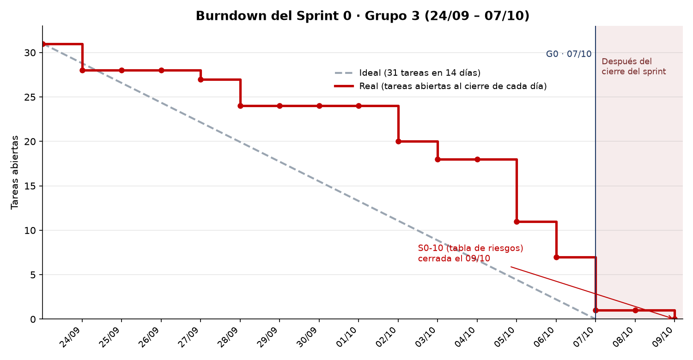

# S0-11 · Informe del Sprint 0

**ISFPP 2026 · Sistema de Gestión de Restaurante · Grupo 3**\
Ingeniería de Software III · UNPSJB, Facultad de Ingeniería, Sede Trelew\
Sprint 0: 24/09 – 07/10 · Gateway G0 · Informe al 09/10 · Fuente de los datos: tablero GitHub Project #2

## 1. Resumen

El Sprint 0 fue de planificación y diseño: plan de desarrollo, Product Backlog, requerimientos no funcionales, decisiones de arquitectura, diagrama de clases del dominio y análisis de riesgos. No se escribió código de la aplicación.

| Indicador | Resultado |
| --- | --- |
| Tareas del sprint que se miden | 31 |
| Cerradas al 07/10 (fin del sprint) | 30 (97 %) |
| Cerrada después del sprint | 1: S0-10 (tabla de riesgos), el 09/10 |
| Tareas que no se cuentan | La daily (S0-12) y la review (S0-11), que duran todo el sprint y no producen un entregable |
| Tareas descartadas durante el sprint | 3: S0-06, S0-07 y S0-08, que no figuran en el tablero ni en el burndown |
| Historias de usuario en el Product Backlog | 64, agrupadas en 25 épicas |

Los cinco criterios del gateway G0 están cumplidos (sección 4). Lo único que llegó después del 07/10 fue la tabla de riesgos con su línea de corte.

## 2. Cómo trabajamos

El equipo son seis personas que trabajan, con un módulo por integrante. Cada uno hizo las mismas cuatro tareas sobre su módulo (revisar las HU, definir el reporte, cargar los riesgos y dibujar el diagrama de clases) en una rama propia, con un pull request hacia `develop` revisado por otro integrante. Después se integró lo de todos:

- **Diagrama de clases.** Cada integrante dibujó su módulo y esos dibujos originales se conservan en `G3 - Diagramas por modulo.drawio`: una página por módulo (M1 y M2 comparten página, además de M3, M4, M5 y M6). De la integración salió `G3 - Diagrama de clases unificado.drawio`, con el dominio sin clases duplicadas y una página aparte para los reportes. Los cambios que aparecieron al unificar (tipos de promoción, factura junto al primer cobro, cliente creado con la reserva, turnos) se aplicaron en las HU del tablero.
- **Riesgos.** Cada integrante cargó los riesgos de su módulo y se conserva esa versión original. La consolidación pasó de 34 filas a 23 riesgos: se fusionaron los que describían lo mismo desde distintos módulos, se descartaron o dieron por resueltos los que no eran riesgos del proyecto o ya los resolvía el diagrama, y se agregaron siete riesgos generales (equipo, uso de IA, plazo). Quedaron en `S0-10-riesgos.md` y en la planilla `G3_Riesgos.xlsx` (raíz del repositorio).
- **Uso de IA.** Los agentes de IA generaron borradores (las 64 HU base, la redacción de riesgos y varios documentos) y una persona revisó y aprobó todo lo que se integró. Las probabilidades de los riesgos de cada módulo las puso cada integrante; las de los siete riesgos generales son una propuesta que el equipo debe validar.
- **Rituales.** Daily al inicio de cada clase y review de cierre del sprint.

## 3. Burndown

La unidad es la tarea del tablero (el sprint no usa puntos de historia), sin contar la daily ni la review. Cada tarea cuenta como cerrada el día en que se cerró su issue, en hora de Argentina. La línea ideal baja de 31 a 0 en los 14 días del sprint; la zona rosada es posterior al cierre.

| Tramo | Tareas cerradas | Abiertas al final del tramo | Ideal |
| --- | --- | --- | --- |
| Semana 1 (24/09 – 30/09) | 7 | 24 | 15,5 |
| Semana 2 (01/10 – 07/10) | 23 | 1 | 0 |

**Lectura.** La línea real estuvo siempre por encima de la ideal. El 74 % de las tareas se cerró en los últimos seis días, con saltos grandes el 05/10 (7 tareas), el 06/10 (4) y el 07/10 (6). Dos causas explican la forma:

- **Dependencias.** La integración del diagrama (S0-09) y la tabla de riesgos (S0-10) necesitan que los seis módulos hayan terminado antes. Esos módulos cerraron entre el 28/09 (M3 y M5, las HU y el reporte) y el 07/10 (M4), y S0-09 se cerró recién el 07/10 a las 18:03. S0-10 quedó para el 09/10 por esa misma cadena.
- **Tareas de la semana 1 cerradas tarde.** S0-04 (RNF) y S0-05 (arquitectura) estaban planificadas para la semana 1 y se cerraron el 05/10, cuatro días después de integrarse el primer PR (RNF, 01/10).

Como la unidad es la tarea y no el esfuerzo, el gráfico no distingue una tarea de media hora de una de un día entero. Para el Sprint 1 conviene estimar cada tarea en horas.

## 4. Criterios del gateway G0

| Criterio | Estado |
| --- | --- |
| Product Backlog priorizado y con criterios de aceptación revisados por cada módulo | Cumplido: las seis tareas «a» están cerradas |
| Tabla de riesgos ordenada por exposición, con línea de corte justificada y planes | Cumplido el 09/10: `S0-10-riesgos.md` y la planilla de riesgos |
| Plan de desarrollo con roles, responsabilidades, hitos, sprints y gateways | Cumplido: `Plan-de-trabajo-Sprint.md` (S0-01) |
| RNF y decisiones de arquitectura documentados | Cumplido: `S0-04-rnf.md` y `S0-05-arquitectura.md` |
| Diagrama de clases integrado, sin clases duplicadas | Cumplido: `G3 - Diagrama de clases unificado.drawio` |

## 5. Riesgos

La tabla final tiene 23 riesgos: 10 de proyecto, 9 técnicos y 4 de negocio. Se gestionan activamente los 7 de mayor exposición y los otros 16 quedan en monitoreo. El corte lo define la capacidad del equipo (seis personas que trabajan y unas cinco semanas hasta el 15/11), no una cifra redonda; la justificación completa está en `S0-10-riesgos.md`.

Los tres riesgos más expuestos son la baja disponibilidad de un responsable de módulo, la revisión superficial o tardía de los PR generados con IA y el Sprint 1 sobrecargado de tareas manuales y documentales. El burndown confirma el último: el equipo ya cerró el Sprint 0 con atraso.

## 6. Qué sale del Sprint 0

| Entregable | Dónde está |
| --- | --- |
| Plan de desarrollo e hitos | `SPRINT-0/Plan-de-trabajo-Sprint.md` |
| Product Backlog (64 HU) y criterios de aceptación | Issues del repositorio y GitHub Project #2 |
| Requerimientos no funcionales | `SPRINT-0/S0-04-rnf.md` |
| Decisiones de arquitectura | `SPRINT-0/S0-05-arquitectura.md` |
| Diagrama de clases unificado | `SPRINT-0/G3 - Diagrama de clases unificado.drawio` |
| Diagramas originales por módulo | `SPRINT-0/G3 - Diagramas por modulo.drawio` |
| Análisis de riesgos | `SPRINT-0/S0-10-riesgos.md` y planilla `G3_Riesgos.xlsx` (raíz del repositorio) |
| Este informe y su burndown | `SPRINT-0/S0-11-informe-sprint-0.md` y `SPRINT-0/S0-11-burndown.png` |

## 7. Paso al Sprint 1

El Sprint 1 va del 08/10 al 21/10 y cierra con el gateway G1. Sus 16 cards (guías de estilo, `AGENTS.md` y `CLAUDE.md`, esqueletos, casos de prueba, Puntos de Función, estimación, criterios de conformidad y GitFlow con CI) están en Sprint Backlog.

Quedan pendientes para el Sprint 1:

- Crear las tarjetas de la estimación por Puntos de Función (una por módulo), los criterios de conformidad, el diseño de las pruebas y GitFlow con la CI. El plan las lista como alcance del Sprint 1, pero todavía no existen en el tablero.
- Validar las probabilidades de los siete riesgos generales con una estimación a ciegas (Delphi de banda ancha).
- Ejecutar en G1 dos mitigaciones de riesgos activos: llevar los supuestos a los docentes y pedir por escrito la fecha de entrega.
